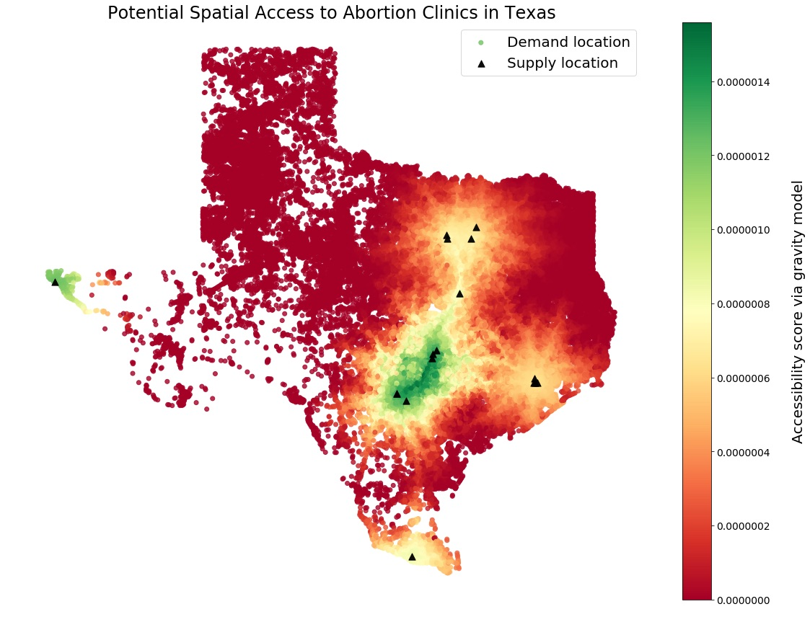

# aceso [](https://badge.fury.io/py/aceso) [](https://travis-ci.org/tetraptych/aceso) [](https://coveralls.io/github/tetraptych/aceso?branch=master) [](http://aceso.readthedocs.io/en/latest/?badge=latest) [](https://opensource.org/licenses/MIT)
Aceso is a lightweight package to calculate 2SFCA and other measures of spatial accessibility.

This package shares a name with [the Greek goddess of the healing proces](https://en.wikipedia.org/wiki/Aceso)[s](docs/images/origin/). The two go hand-in-hand, since the most common applications of 2SFCA and gravity models of spatial interaction are for measuring spatial access to healthcare services.

For usage examples, view [the documentation](http://aceso.readthedocs.io/).

## Installation

`aceso` is available on [PyPI](https://pypi.org/project/aceso/) and can be installed via the following command:

```
pip install aceso
```

The only dependency is `numpy`.

## Gallery


